**PRAKTIKUM 4 --> COLLECTION LIST,MAP,RECORD,FUNCTION**

Nama    : Novita Dwi Rahmadani

NIM     : 2142720050

**Praktikum 1 --> Eksperimen Tipe Data List**
    1. Langkah 1:
        Mengetikan sebuah kode program ke dalam void main()
    2. Langkah 2:
        Eksekusi kode 

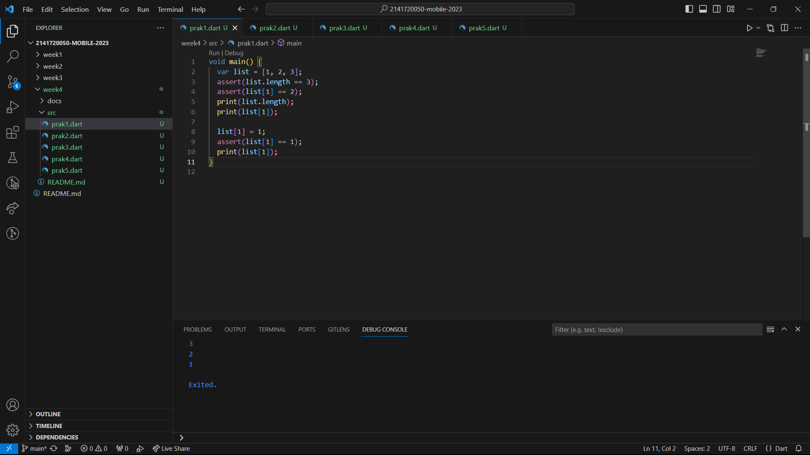

    3. Ubah kode pada langkah 1 menjadi variabel final yang mempunyai index = 5 dengan default value = null. Isilah nama dan NIM pada elemen index ke-1 dan ke-2. Lalu print dan capture hasilnya. Apa yang terjadi ? Jika terjadi error, silakan perbaiki.
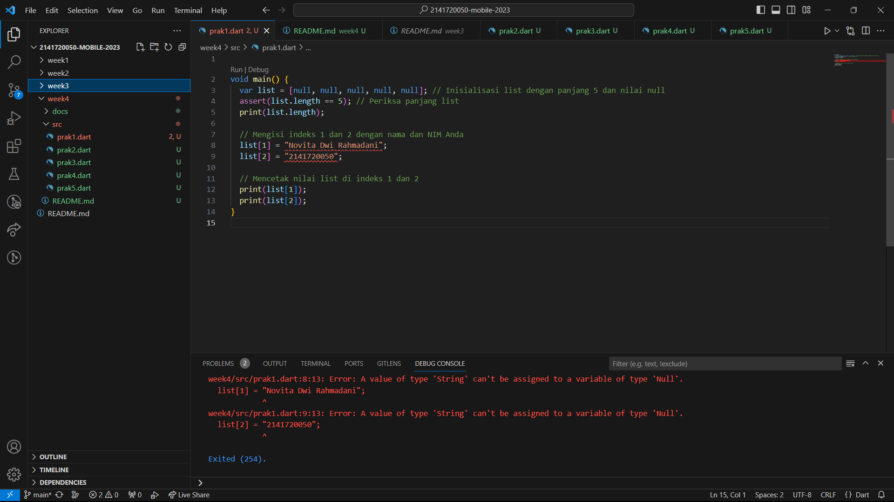
    Penjelasan : Menghasilkan error karena mencoba mengisikan nilai string ke dalam elemen-elemen list yang sebelumnya diinisialisasi dengan null. Dalam bahasa Dart, jika ingin menyimpan nilai non-null dalam list, perlu mendeklarasikan list dengan tipe data yang sesuai dengan nilai yang akan simpan.Dalam kode memulai dengan deklarasi var list = [null, null, null, null, null];, yang secara tidak langsung memberikan Dart informasi bahwa list ini adalah List<Null>, yang berarti list ini hanya dapat mengandung nilai null.Kemudian, ketika mencoba mengisi elemen di indeks 1 dan 2 dengan string, seperti list[1] = "Novita Dwi Rahmadani";, Dart menghasilkan error karena mencoba menggantikan nilai null dengan string, yang tidak diizinkan dalam list yang dideklarasikan dengan tipe data List<Null>. 
    
    Perbaikan :
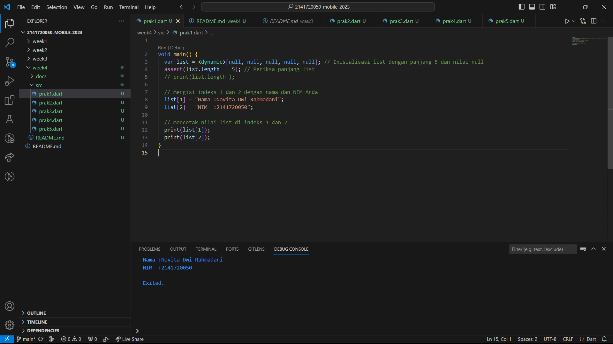
    Penjelasan : Tidak terjadi error karena sudah mendeklarasikan list sebagai List<dynamic> atau List<Object>, yang memungkinkan list mengandung nilai dari berbagai tipe data, termasuk null dan string.
    

**Praktikum 2 --> Eksperimen Tipe Data List**

    1. Langkah 1 :
        Mengetikan sebuah kode program kedalam fungsi main()
    2. Langkah 2:
        Eksekusi Kode:
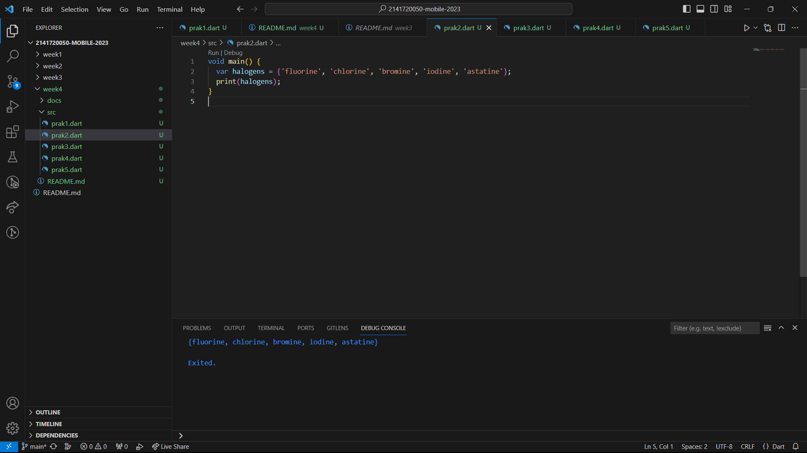
        Penjelasan : Tidak terjadi error karena menggunakan set literal, yang secara otomatis mengidentifikasi tipe elemen yang akan disimpan dalam set. Dalam kasus ini, Set halogens diidentifikasi sebagai Set<String>, sehingga hanya elemen-elemen bertipe String yang dapat dimasukkan ke dalamnya. Jika mencoba memasukkan nilai dengan tipe data yang berbeda, akan mendapatkan kesalahan tipe data. Contoh di atas tidak menghasilkan error karena semua elemen dalam Set tersebut adalah string, sesuai dengan tipe data yang diidentifikasi pada saat inisialisasi.
    3. Langkah 3:
        Menambahkan kode program menggunakan tiga variabel dan menambahkan elemen Nama dan NIM pada kedua variabel set dengan dua fungsi berbeda yaitu.add() dan .addAll().
    

**Praktikum 3 --> Eksperimen Tipe Data MAPS**

 1. Langkah 1 :
        Mengetikan sebuah kode program kedalam fungsi main()
2. Langkah 2:
        Eksekusi Kode:
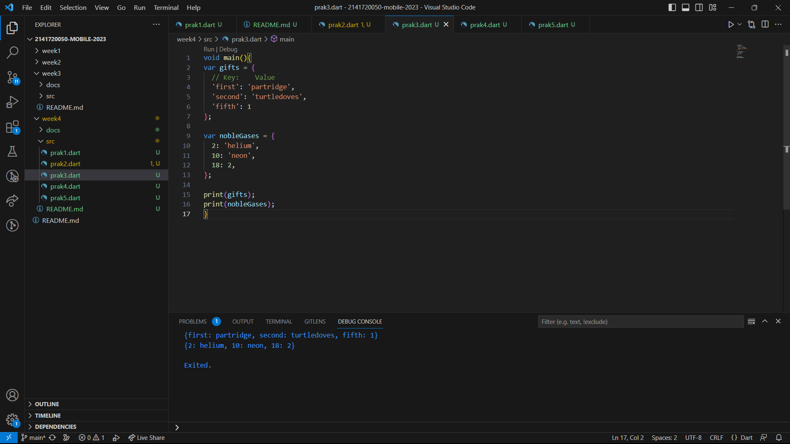
    Penjelasan : kode diatas mendefinisikan dua variabel map(gifts dan noblegases) dengan pasangan key-value. Kemudian, program mencetak isi kedua map tersebut ke layar. Kesimpulan dari alur kode ini adalah untuk menunjukkan cara menginisialisasi dan menggunakan map dalam fart serta cara mencetak nilai dari map ke layar.
3. Langkah 3: 
    Menambahkan elemen nama dan NIM pada tiap variabel (gifts, nobleGases,mhs1, dan mhs2)
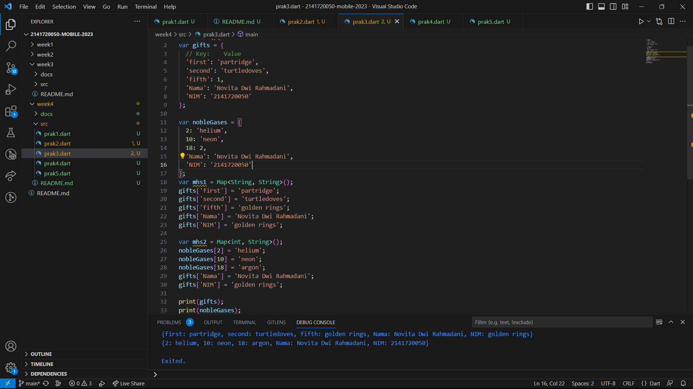
    Penjelasan :
    Kode diatas menginisialisasi dua variabel Map, yaitu gifts dan nobleGases, dengan berbagai pasangan key-value. Selanjutnya, program mencoba mengubah beberapa nilai dalam Map tersebut, namun terdapat beberapa kesalahan dalam perubahan nilai yang dilakukan, seperti mengganti elemen 'Nama' dan 'NIM' dengan 'golden rings', yang tidak sesuai dengan maksud aslinya. Terdapat juga dua variabel Map tambahan, mhs1 dan mhs2, yang dideklarasikan tetapi tidak diinisialisasi dengan nilai apapun. Akhirnya, isi dari Map gifts dan nobleGases dicetak ke layar menggunakan fungsi print(). Kesimpulan utama adalah kode ini berfungsi untuk menunjukkan penggunaan Map dan perubahan nilai dalam Map, tetapi terdapat beberapa kesalahan dalam perubahan nilai tersebut.

**Praktikum 4 -->Eksperimen Tipe Data List: Spread dan Control-flow Operators**
    	1. Langkah 1 :
        Mengetikan sebuah kode program kedalam fungsi main()
        2. Langkah 2:
        Eksekusi Kode:

        Penjelasan : Terjadi error, Karena list 1 tidak ditemukan atau tidak terdeklarasi.
        Perbaikan :
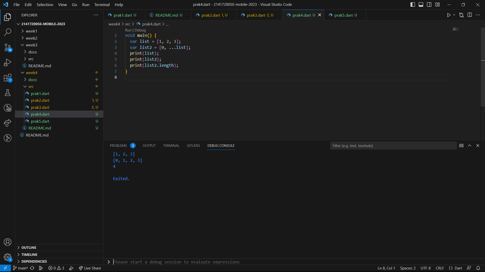
        Tidak terjadi error lagi, karena list1 telah dihapus.
        3. Langkah 3:
        Menambahkan kode  program dan menambahkan variabel list berisi NIM menggunakan spread operators.

        Penjelasan : Terjadi error, karena menggunakan operator null-aware spread (...?) pada list1, yang memiliki elemen dengan tipe int? (nullable integer). Operator null-aware spread hanya dapat digunakan pada tipe data yang tidak nullable (non-nullable).
        Perbaikan :

        Penjelasan : Yang telah diperbaiki sehingga tidak terjadi error yaitu menghilangkan operatpr null-aware spread.
        4.Langkah 4:
        Menambahkan kode program 

        Penjelasan : Kode tersebut menghasilkan error karena menggunakan kondisi if (promoActive) dalam literallist yang menginisialisasi variabel nav, tetapi variabel promoActive tidak dideklarasikan atau tidak memiliki nilai yang dapat diakses dalam konteks kode tersebut.

        Perbaikan :
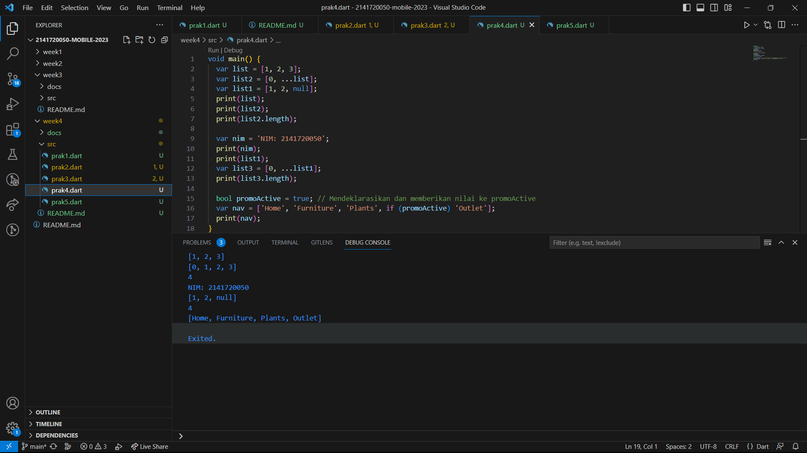
        Sekarang, variabel promoActive telah dideklarasikan dan diberi nilai true, sehingga kode tidak akan menghasilkan error.
        5. Langkah 5:
        Menambahkan kode 
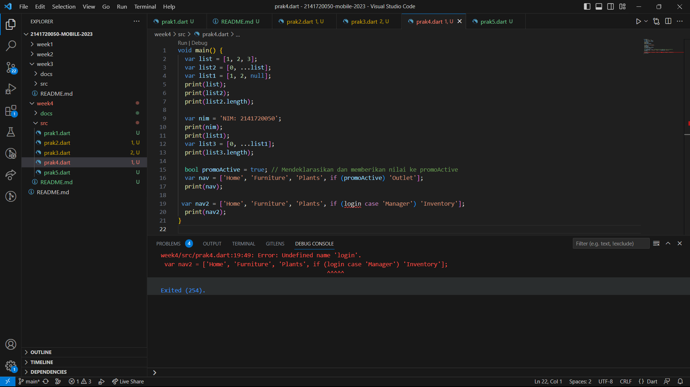
        Penjelasan : Kode tersebut menghasilkan error karena menggunakan sintaks yang tidak valid dalam ekspresi kondisional dengan if. Dalam kode, mencoba menggunakan if (login case 'Manager') 'Inventory', yang bukan merupakan sintaks yang valid dalam bahasa Dart.
        Perbaikan :
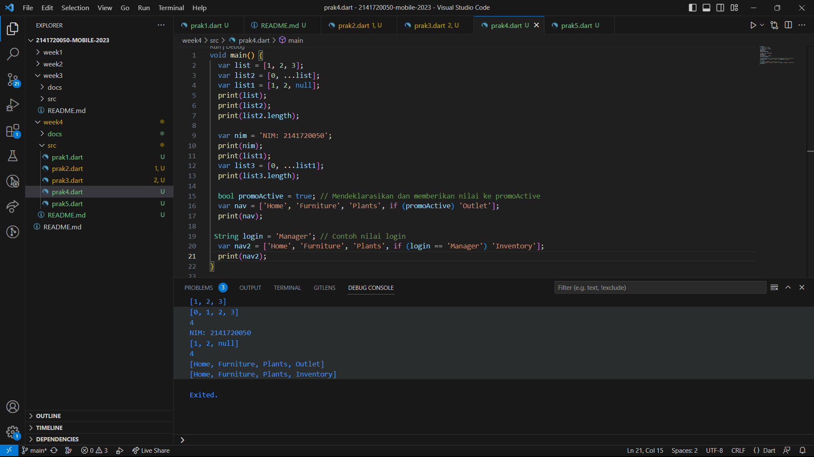
       Dalam kode di atas, variabel login telah dideklarasikan dan digunakan dalam ekspresi kondisional dengan benar menggunakan operator == untuk memeriksa apakah nilainya adalah 'Manager'.
       6. Langkah 6:
       Menambahkan kode program dan jelaskan manfaat Collection For

       Tidak terjadi error.
       Manfaat Collection for : Manfaat utama dari collection for adalah menyederhanakan kode dan membuatnya lebih mudah dibaca. Dengan collection for, dapat mengisi koleksi dengan elemen-elemen yang sesuai dengan pola tertentu atau melalui iterasi, tanpa perlu menulis loop eksternal. Ini mengurangi kerumitan dalam penulisan kode dan memungkinkan pengembang untuk lebih fokus pada tujuan bisnis dan logika aplikasi daripada detail implementasi iterasi. Hal ini dapat meningkatkan produktivitas pengembangan dan mengurangi potensi kesalahan yang terkait dengan iterasi manual. Sebagai hasilnya, collection for dapat membantu dalam mempercepat pengembangan perangkat lunak dan menjadikan kode lebih bersih dan mudah dipelihara.

**Praktikum 5 -->Eksperimen Tipe Data Records**

    1. Langkah 1:
     Mengetikan sebuah kode program kedalam fungsi main()
   2. Langkah 2:
        Eksekusi Kode:
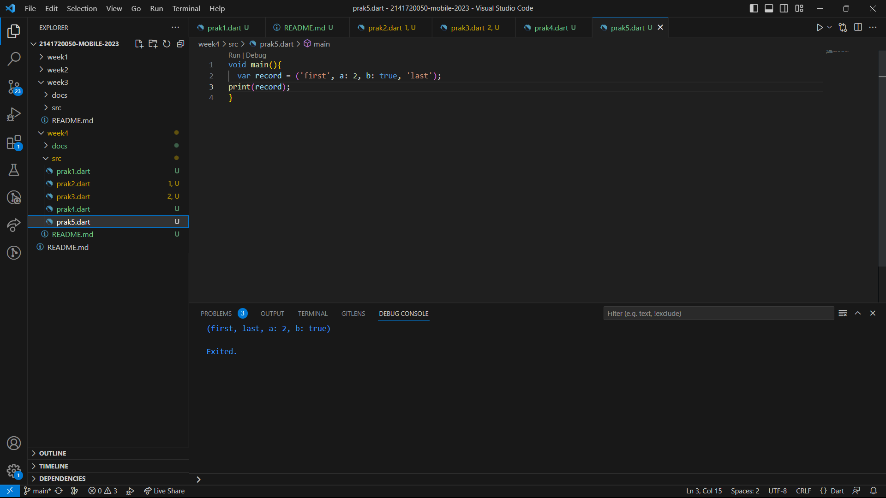
   3. Langkah 3:
   Menambahkan kode dengan menggunakan fungsi tukar() di dalam main() sehingga tampak jelas proses pertukaran value field di dalam Records.
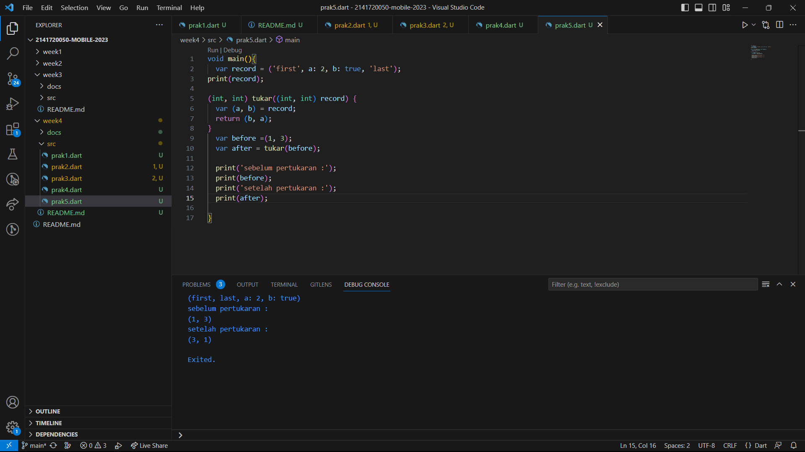
   4. Langkah 4:
   Menambahkan kode didalam scope void main() 
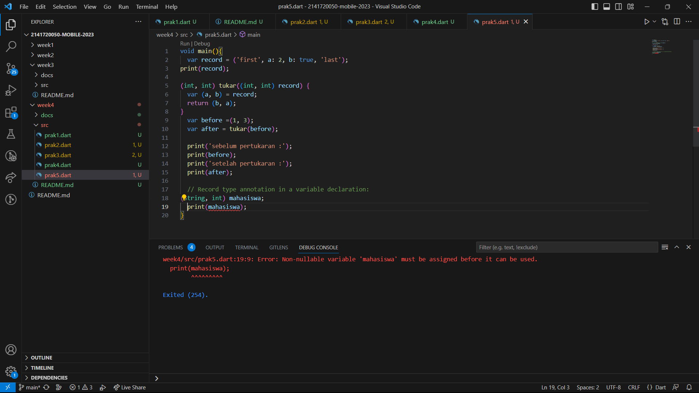

    Penjelasan : Terjadi error karena variabel mahasiswa belum dideklarasikan.
    Perbaikan:
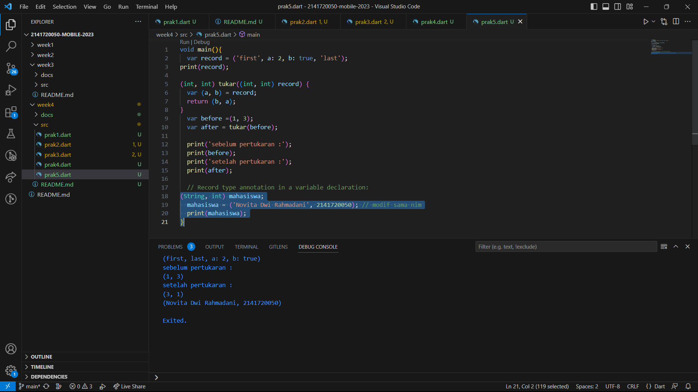
5. Langkah 5:
    Menambahkan kode

    Tidak terjadi error.
    Modifikasi

**TUGAS PRAKTIKUM**
1. Dokumentasi sudah dilakukan pada laporan diatas.
2. Jelaskan yang dimaksud Functions dalam bahasa Dart!
Jawab : Functions dalam bahasa Dart adalah blok kode yang dapat digunakan untuk melakukan tugas tertentu atau menghitung nilai, dan mereka dapat dipanggil atau dieksekusi berulang kali sesuai dengan kebutuhan dalam program. Functions memiliki nama yang dapat digunakan untuk memanggilnya, dan mereka dapat menerima argumen sebagai input, melakukan operasi pada argumen tersebut, dan mengembalikan nilai sebagai hasil. Dart mendukung dua jenis functions, yaitu functions yang mengembalikan nilai (disebut juga dengan functions dengan nilai kembalian) dan functions yang tidak mengembalikan nilai. Functions sangat penting dalam pemrograman Dart karena memungkinkan pemisahan logika program menjadi bagian-bagian yang terorganisir dengan baik, mempromosikan penggunaan kembali kode, dan membuat kode lebih mudah dipahami dan dikelola.

3. Jelaskan jenis-jenis parameter di Functions beserta contoh sintaksnya!
Jawab :
    - Named Parameter: Named parameter adalah salah satu jenis parameter dalam Dart yang memungkinkan untuk memberikan argumen ke fungsi berdasarkan nama parameter yang sesuai. Ini memungkinkan untuk memilih parameter mana yang ingin isi saat memanggil fungsi, bahkan jika fungsi memiliki banyak parameter opsional. Named parameter sangat berguna dalam membuat kode lebih jelas dan memudahkan pemahaman saat memanggil fungsi dengan banyak argumen opsional.
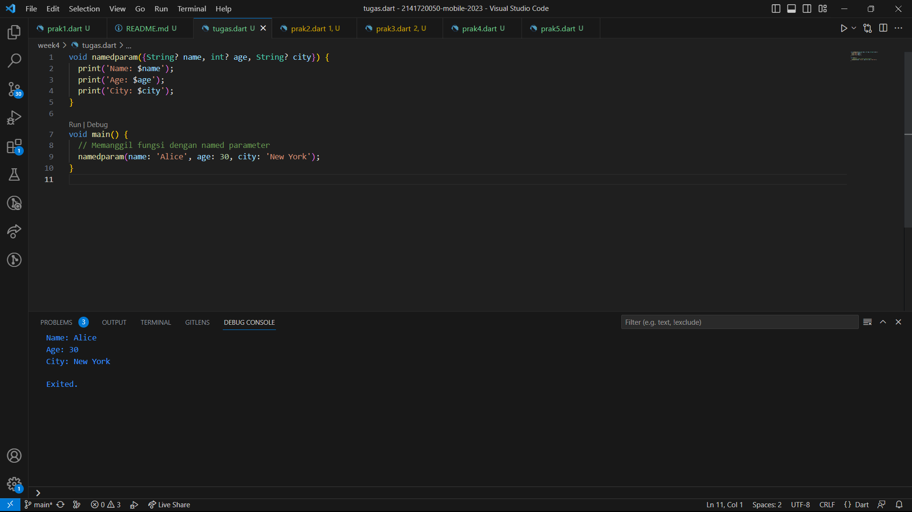
    - Optional Positional Parameter adalah jenis parameter dalam Dart yang memungkinkan untuk memanggil fungsi dengan argumen yang bersifat opsional berdasarkan posisi, yaitu berdasarkan urutan parameter yang telah ditentukan dalam definisi fungsi. Parameter ini ditandai dengan tanda kurung siku kotak [] di dalam definisi fungsi. dapat memilih untuk menyediakan atau tidak menyediakan argumen untuk parameter ini saat memanggil fungsi, dan urutan argumen akan sesuai dengan urutan parameter.
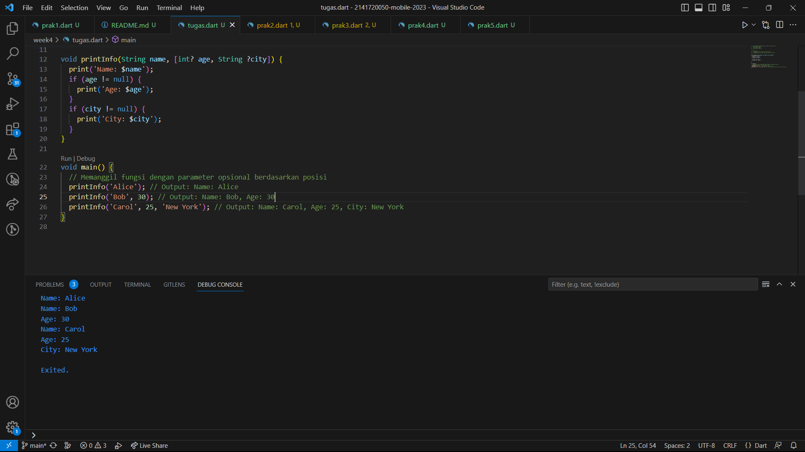

4. Jelaskan maksud Functions sebagai first-class objects beserta contoh sintaknya!
Jawab : Konsep "first-class objects" dalam pemrograman merujuk pada kemampuan suatu bahasa pemrograman untuk memperlakukan fungsi (functions) seperti tipe data lainnya, seperti integer, string, atau objek lainnya. Dalam konteks ini, fungsi dianggap sebagai nilai yang dapat disimpan dalam variabel, dioperasikan sebagai argumen dalam fungsi lain, dan dikembalikan sebagai hasil dari suatu fungsi. Fungsi yang mendukung fitur ini disebut "functions as first-class objects."
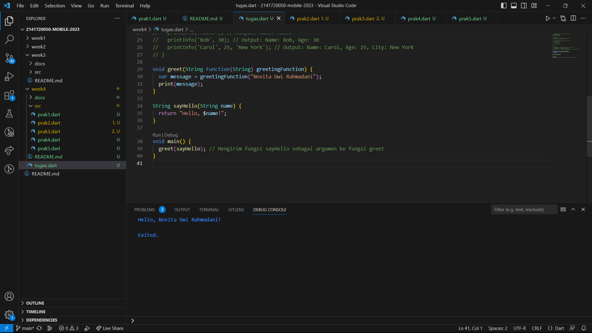

5. Apa itu Anonymous Functions? Jelaskan dan berikan contohnya!
Jawab : Anonymous functions, juga dikenal sebagai lambda functions atau function literals, adalah fungsi yang tidak memiliki nama. Mereka adalah cara sederhana untuk mendefinisikan dan menggunakan fungsi secara langsung di dalam ekspresi atau sebagai argumen dalam pemrograman. Anonymous functions sangat berguna dalam situasi di mana  perlu mengirimkan fungsi sebagai argumen ke fungsi lain atau ingin membuat fungsi sederhana tanpa harus memberikan nama.
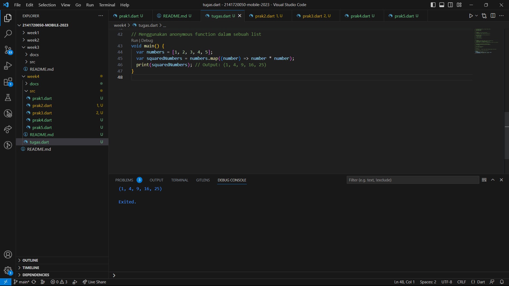

6. Jelaskan perbedaan Lexical scope dan Lexical closures! Berikan contohnya!
Jawab : 
-Lexical scope adalah aturan yang menentukan di mana sebuah variabel dapat diakses dalam kode berdasarkan tempat di mana variabel tersebut didefinisikan dalam kode sumber.
contoh :
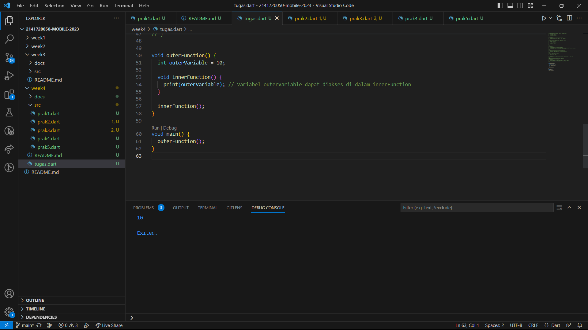

- Lexical closures adalah konsep yang terjadi ketika sebuah fungsi (closure) dapat mengakses variabel yang didefinisikan di luar fungsi itu sendiri, bahkan setelah fungsi tersebut selesai dieksekusi.
contoh :

7. Jelaskan dengan contoh cara membuat return multiple value di Functions!
Jawab : Dalam Dart, tidak dapat secara langsung mengembalikan beberapa nilai dari sebuah fungsi seperti yang dapat lakukan dalam beberapa bahasa pemrograman lain. Namun, dapat mengembalikan beberapa nilai dalam bentuk List atau Map.
contoh :
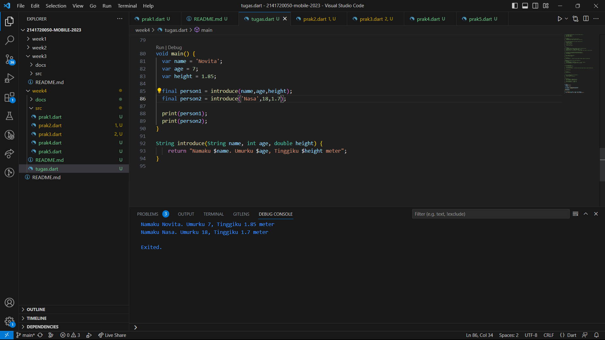

